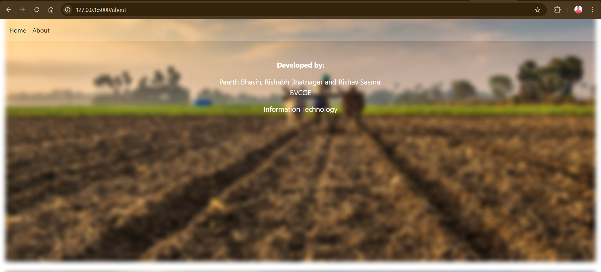
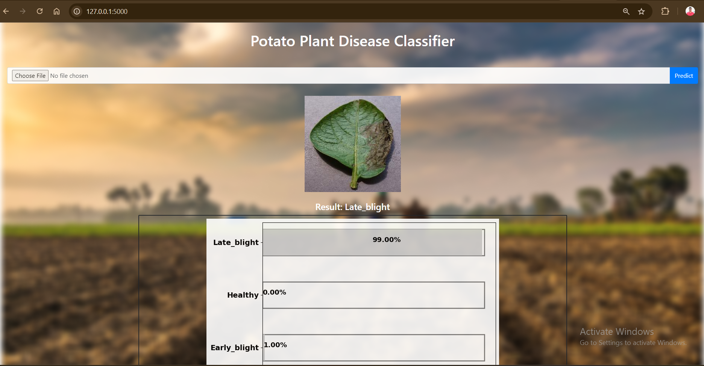

# Potato Plant Disease Classifier
About: In this project we aim to build a web app that can assist farmers in detecting potato plant diseases. The application will be able to classify the disease in an infected potato plant using it's leaf and Convolutional Neural Networks. 

# Run 🎯
### 1. Download or clone the repository
### 2. Open cmd or terminal or powershell
### 3. change directory (cd) to `Potato-Plant-Disease-Classifier-master`
### 4. Enter `pip install -r requirements.txt`
### 5. Enter `python app.py`

**If you face an issue regarding tensorflow installation:-**  

**Open Windows Powershell from Anaconda Navigator if installed (Windows 64-bit).**  
**Type: cd '.\<complete path for Potato-Plant-Disease-Classifier-master folder>\'**  
**Type: conda create --name tensorflow python=3.12  or any other version supporting tensorflow**  
**Type: conda activate tensorflow**  
**Type: pip install tensorflow**  
**Type: pip install numpy**  
**Type: pip install flask**  
**Type: pip install matplotlib**  

**Type: python app.py**  

**Ctrl + Click on the generated address to open the website.**  

**To check the installed versions:-**  
**Type: pip show tensorflow**  
**Type: python --version**  
**Type: pip3 --version**  
**(Type:  'pip install --upgrade pip' if required)**  
**Sample versions: Python - 3.12.0, Tensorflow - 2.17.0, Pip - 24.0**  

